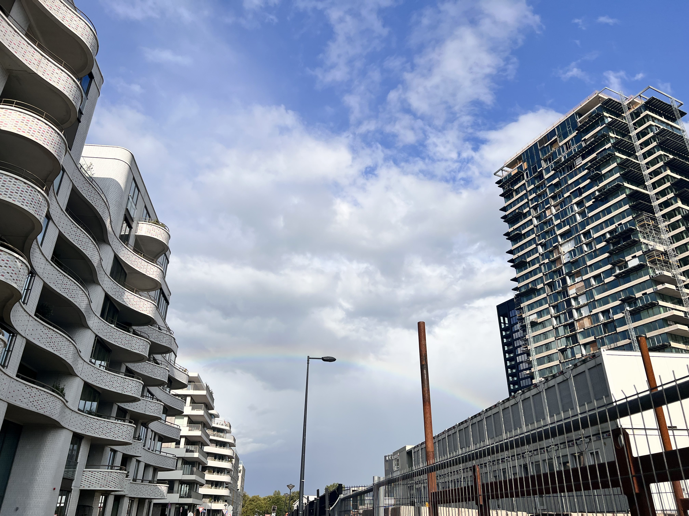

<!---
date: 2023-08-26
authors:
  - otto
categories:
  - thoughts
--->
#2023-08-26 变化多端的天气

我想每天都写一篇日记的。
然而实际上我不知道怎么写。
没有不适应，没有异样感。
我觉得这应该和我的顿感有关吧。
今天去隔壁的公园跑步了，就像是居住很久的居民一样。
实际上我来了才4天。
I feel displaced everywhere.
In some way, less displaced everywhere.

