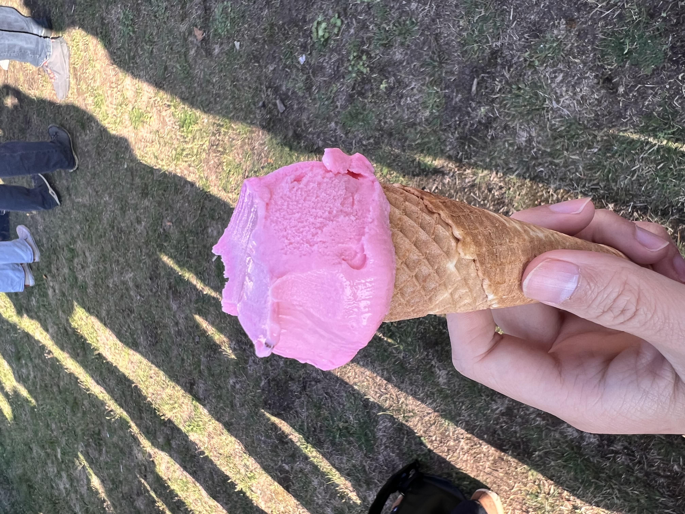

<!---
date: 2023-09-01
authors:
  - otto
categories:
  - thoughts
--->
#2023-09-01 天气还是多云
昨天是新生日，我错过报名。
兜转了两天给错误的部门发邮件之后，成功发到正确的邮箱，得到了邀请函。
去了之后我发现，这不是必须，没有人检查你是否注册成功。
我的人生仿佛就是这样一直活在惶恐里面。
非常多的中国人，出乎意料的多。
也有一些外国人。
什么都让我惶恐。
我尽量表现得外向，像回到了每个刚进入下一个阶段的瞬间。
自己感觉自己没什么成长，可能有吧。
需要我这个npc的玩家给我一个客观的评价。
有一个女生非常的能social，到处找国人找外国人聊天。
我也尝试加入了一次谈话。
不舒服。
感觉对面的外国人也很内向，也一度感觉不舒服。

前几天才知道自己这个track的课不够好。
一直兜转找各个部分想换，但是一直没成功。
还在等到协调员给我恢复。
再次。非常惶恐。
我的世界全是惶恐。
朋友很忙。
呼吸，呼吸，呼吸很难。
