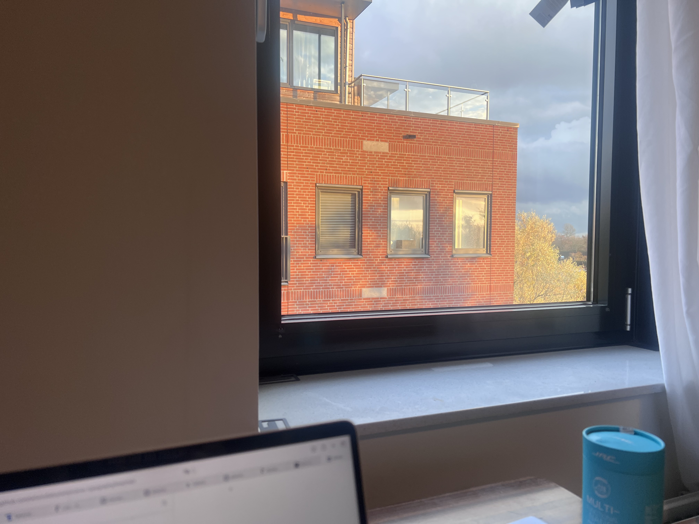

# 2024-09-02 Cold Sunlight
Second day of December. The year is close to an end.
What do I think about myself? How can my life reflect my own personal thoughts?
Am I a failure? Should I bother to ask me those questions.

Right now I am looking outside the window of the apartment in Arnhem.
The shadow of leaves reflects in the windows of neighbor's room.
You can see the sky far away from the windows.
It looks warm. The sunlight looks warm. My heart is being filled with an instant warm feeling.
The leavers are dancing with the wind breezes.
The life suddenly feels alive. The movement of living.

Should I feel alive? If you go out and feel the sun, the sunlight is actually cold.
You have to hold tight to your coat and wrap it around your body tightly.
Other than the trees I can witness, there are trees that have their leaves fallen out.
They look dead.
The other side of the sky, the dark cloud is coming. The warm-looking sunlight is
about to disappear.

That is what I can feel about my life.

Will I ever be satisfied about my life? I don't know. I know I am growing up.
It is weird to say that I am growing because I am already a grown-up regarding my age.
I am still growing up. The tree looks dead. Their young leaves are waiting under
the dark stems. When the sunlight is warmer, they will break out.

I must say I should be more brave. I need to be. 
