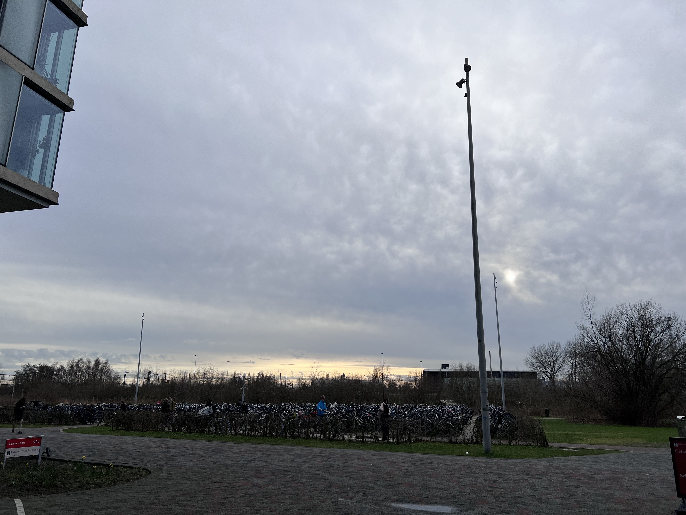
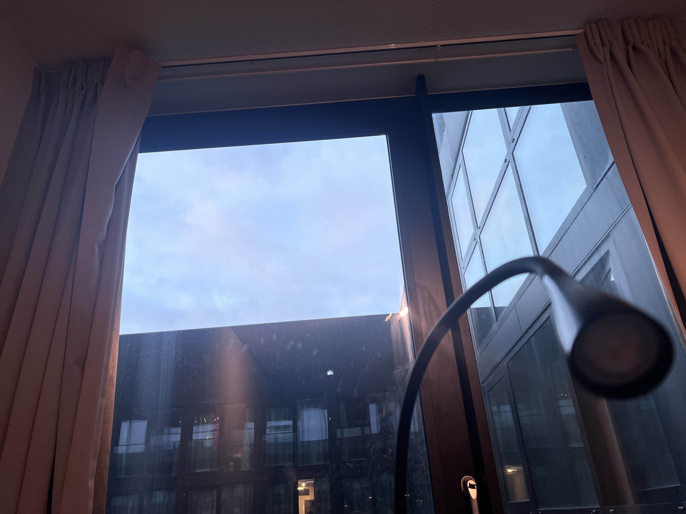

# 2024-02-17

## A cry

C said she felt down two days ago. We met up in the hallway, and she started to cry.
I was concerned. I totally understood the frustration sometime. In fact, I had a mental
breakdown just several days ago. She said she had a new course, and she lost it when her
teammates dropped her with some links that she had no ideas about. I always stoned when others
cried. I calmed down and try to analysis the situation ASAP. Surprisingly I could tataly
comprehend the assignment she was dealing with, which required data analysis with R.
Fortunately I had worked on that. We sat down, and I looked through the document.
It won't spend much time for someone who was seasoned. She just had not enough experience.
I assisted her to look up the data. She got on track really quick. Of course, she recovered
from the sad mode also really quick.

People always overestimated something when they were not familiar with it. In TV shows or movies,
programmers typed insanely fast and wrote codes nonstop with fancy geek background, while in
reality, programmers just copied codes from somewhere and pasted into the screen. LOL.
I am not saying this to say I was so sophisticated that I knew much more knowledge than others.
I fell into emotion cage a lot. What I am trying to say is that, you should always seek out for
help. Yes, people who live outside your situation can sometimes feel less empathetic, but
they could also give fresh views sometimes. I am not gonna live, I am a talker.
When I am down, or I feel struggled, I want to talk to others. It is a shift of mood. Meanwhile,
you can really inspire by others. Even sometimes, I gain courage by talking to others. For example,
I missed a deadline the other day, and instantly I was anxious. I knew I had to send a email to clarify
the situation, but I was afraid to. Instead, I chatted with a classmate. It did not matter
what he said. I just made up my mind gradually when I talked to him. Eventually I sent out the email.
"No, this is no problem." That was the response from professor.

## A video call
This was the video call caused my delay on my assignment, but I am not blaming it.
My friend and I shared our recent stuff, and our thoughts on trip adventures.
You could see so much divergence here. I was an adventurous guy. I was more into nature.
For me, a big city was just another place with other people I did not know. That's to say,
I would rather go to Yellow Stone Park than New York City. Meanwhile, she was more into big
cities. She visited Tokyo this Spring Festival. I enjoyed the trip adventure she shared.
It was eye-opening to see the differences between different cities when we put them into comparison.
Tokyo was a big city, but its subway was operated by many different coperations. This was quite troublesome.
China's subway system was convenient for people without physical disability while people in
wheelchair would suffer a lot. In Japan, people were quite in public transportation. You could never
see that in China. In the Netherlands, people also talked a lot.

We also shared our ideas on a group vocation. I was always easy-going. I though any kind of
experience, even some upset one, were part of your life adventure. You should always embrace it.
She said she was still learning not to behave immature in a trip. I agreed that she could be a kid sometimes
although it did not bother me that much. Anyway, one common sense that everyone should understand was
that we all should always learn. I also learnt a lot from her, or other friends.

I share with you the sky at 18:28 today. It is still bright. The spring is coming. Will my life be better from now?
I hope so.