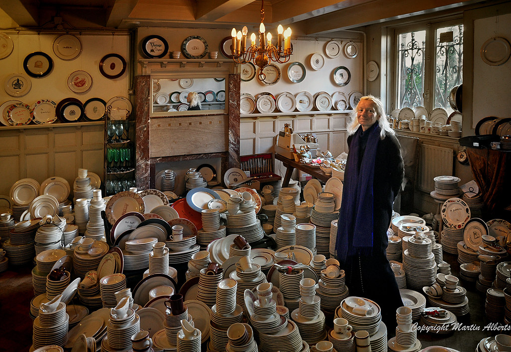

# 2023-02-25 Half rainy Half sunny

## Golden Bend
Yesterday afternoon I went to a home goods store called golden bends. My two friends brought alone
with their two Dutch friends. Amazing they were so good at making friends.
I meant if I wanted, I could make some possibly. However, everytime I spent too much
time with human, I felt sick. But still, I loved how they managed to be so kind, and they deserved
more friends.

Golden Bend was a store selling some vintage china. The store was quite small, but filled with so many antiques.
Below is picture from internet.

It was difficult to dig since the plated are stacked one by one. I stepped in cautiously. Step
by step, I tried so hard to not make my heel trip any pile of plates down. I had instinct that one
pile should contain some plates I loved. One by one, I held some plates in my hands until I discovered
three plates in a row. Two with delicate drawing of yellow flowers and one bee on them, one
with four blooming purple flowers. I loved them instantly. I tried to discover more and heard some noises of
plates breaking. A lady with high heels knocked down some cups. I looked to the owner, old lady
, and we exchanged some eye contacts. Hahaha, it felt like we were the only sophisticated people
in the room. I decided on two plates with yellow color since I wanted to keep consistency.
7.75 for each and 15 for two. I finished transferring and walked out of the small door.
The sky was pure blue, not much sunlight.

## Birthday Party

I scheduled my time and went to the party half an hour late. I did not want to get
involved into conversation so early. It was a Chinese restaurant, Full Moon Garden.
I walked into the door. To my surprised, it was much more formal than I thought.

Two middle age men faced back to the door. I sat in the seat cross the table facing them.
They two did restaurant business here, Chinese chef I guess. One is birthday boy's dad.
Next to them is a young man with glasses. I was genius to not arrive so early.
They waited to start until everyone was there. A bit too Chinese-ish. There were two
people on the way. Yeah, I was not the last and also did not have to stuck into start-up
awkwardness for too long. If I knew they would wait, I should tell them to arrive earlier with me hhh.
Y arrived when we almost finished, much more awkward as he owned everyone's attention lol.

Later when all people arrived we did our self introduction.
The young man immediately said he came from the same place with me. Such a coincidence.
I came from a very little town, I never thought I could meet someone from same city.
He could speak some ChaoShan dialect, but not much since he moved to Guangzhou at 4.
Isn't it amazing? I came to the party and ran into coincidence I would never imagine about.

The meal was delicious. Last time I enjoyed so many dishes in one time? I could not even
remember. I did not count, but 12 dishes at least, not including the cake and fruits.
LOL I was proud of my gorgeous plates, but I could not find an elegant way to wrap them.
Assuming the dinner would be casual, I left them as they were when purchased from the store owner,
simply wrapped in newspaper. I was embarrassed to take them out. As soon as we got out of
the restaurant, I discreetly passed the plates to L and asked him to tell birthday boy about
my present as soon as they arrived at home hahahha.

Later I found oue friend of birthday boy lived in the same apartment as me. Another coincidence.
We took tram back together and shared some living experience.

## Conclusion

Conclusion. Am I writing a report? Anyway, this is a conclusion. Again the party reminded me of
my family again.
I am tired. Maybe I will add up later.