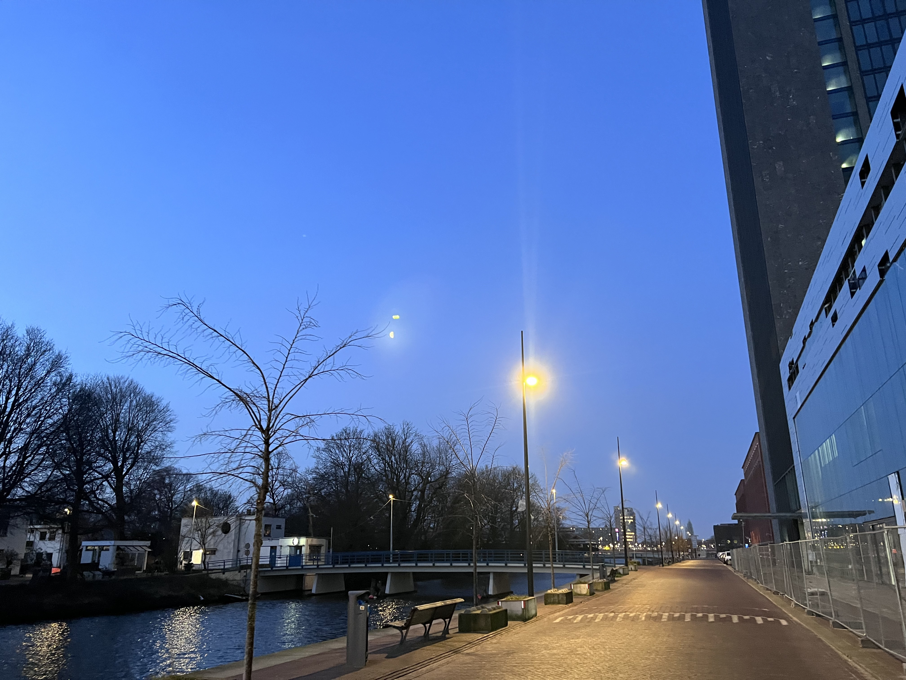

# 2024-02-04
Loneliness came to me like a sniffing dog. I learn this from a book I am reading.
I watch `Monster` by Koreeda today and `The Holdovers` by Alexander Payne yesterday.
Both highly qualified movies.

Monster gets me. Nostalgia came to me like a sniffing dog. I remember a friend back in primary schook.
We did not share a long term friendship. He lived in the corner of the village, which meant behind his home,
a wild field stood there. Besides, in front of his home, there was an empty area same size as a basketball court,
where we used to play soccer. I always visited him in the weekends. The wild field was our paradise.
People nowadays worried a lot about parasite, cleanness. Those never occurred to our mind, or
any children growing up in the nature 's mind. We smoothed the weeds in a small hillside and
created mysterious tunnels. Some tunnels went into farming fields, some tunnels went into narrow roads
leading to next village. I made this sound like Alice's Wonderland. Actually, it was raw and small.

However, I remember those happy times, just as I remember bitter times. I always grew up as the child
with no friends. I felt overwhelming happy when I finally had a male pale to play King-Of-Wild like stuff.
I never understand how he sees me. Our friendship broke as he slapped me in the face for
any stupid reason I could not remember. In Junior 2nd, when I was being regularly lonely kid, watching students passing
by from second floor as I leaned on the railing, he took off my pants. He laughed and went away.
I was not ashamed or shocked. I was just confused. Why would he do that? I might never get the answer.
He got married maybe five or six years ago and played his part in one of the most common, typical
Chinese families.

# The holdovers
I always felt like a holdover, an outsider. I loved the acting of Paul Giamatti.
As you grew up, you showed sympathy to more and more people because you always see one side
of you from other people. Harsh people as they are, they have their soft spot. My mon was picky,
sometimes mean when she tried to judge other people. Meanwhile, she was kind, she was sensitive (yes,
people can be rude and sensitive). I saw different dimension. I remember this post I saw today:
```
Your kids are gonna figure you out someday.
I promise you they are.
The type of parent you are. The type of spouse you are.
How you treat others. How much effort you put into them.
You will be someone they look up to, or someone they never wanna be like.
```

To some extent, it is true, but I always have mix feeling about my mom. It is cliché to say
that you parents had tried their best to raise you up, but I had to put into my mom's shoes.
I remember she cried, she yelled and she tried to take her own life by drinking a bottle of medichine oil.
I am pretty sure for a period of time she was so depressed, while she still had to wake up early
and take care of the whole family. I remember when she took us to random friends or relatives' places so
that she could borrow some money for next day's groceries. I recall when I was six, I was still quite a
crier. She would carry me on her back, pumped the old water pump and brought a bucket
of water back. There are too many details, painful details I can recall. They hurt so much to me,
who was still a coddler when these things happened to my mom.

I forgave my mom long long time ago. I forgave her for pushing us four kids out of the door while she was
devastatingly bawling on the other side of the door. I forgave her for hitting me so hard with various equipment when I was being a kid.
I forgave her for laughing at me when I covered myself with an umbrella taking a dump in urinal publicly because we
did not own a toilet because I know she saw me and she managed to borrow money from sarcastic relatives for a house
with toilet.

## Our weakness, our strength
I talked with Cici the day before yesterday. We could both agree, it was quite disappointing
that we knew a lot in Chinese, but we could hardly translate our ideas into English. We loved Koreeda,
but we could never say to a foreigner that we liked Shizhiyuhe(Koreeda's Chinese spelling). We had to try
harder to remember those while others, even Dutch, only needed to remember their English names. It sounded almost like
a bully hahaha. Anyways, We have already shared common ideas that the most important personalities, or qualities,
are self-confidence and fearlessness. We could do nothing but go on.

## Personal Review Today
I had this course that I had to record a video to do a presentation. While I was editing the video, I was obligated to
listen my oral English over and over again. OMG, that sounded awful. It might me being overconfident, but I always thought
my accent was not that bad. However, my pronunciation sounded like shit. I needed to work harder, again. Again.

I tried to capture this moment of me going out at 7am with crescent moon up in the sky, but this was not a decent photo.
Though I still loved the calmness here. Good day.
