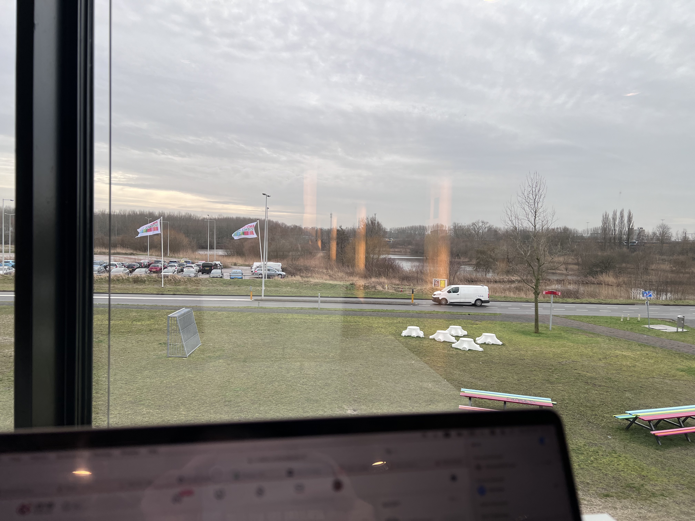

# 2024-02-21

I could not get anything done today. I felt mix feelings. I felt so anxious that I did
not want to do any work. Meanwhile, I opened the window, and listened to the wind sound.
Some chill wind breezed through my feet, I felt calm. 

Sometimes I just felt too lifeless to do anything. My soul was suck off. Why can I
enjoy the moment of not doing anything. How I envied those European not feeling any
sense of guilty for doing nothing. Everything for me was a trigger. My mom unintentionally
asked my if I would do any internship in the summer. I knew, mom, I knew it all.
I felt pressure coming back to me when you asked that. I know, you tried to understand the
fact you should not ask so much from your child. I wished I could share you with
my inner feelings more. I watched `All of us strangers` today. I cried hard.
Andrew's parents died in a car accident when he was 12. I felt the pain. I felt the loneliness.
I grew up with you around, but I still felt alone. I could not feel reality.
When I should be happy, I could not sense any increasing heartbeat. You were some parts to
blame. Mom, should we still keep our relationship as two people occasionally greet each other?
I did not know. Yiyun Li's youngest kid died days ago. Her second child took his own life
years ago. It definitely was devastating for her. I guessed you never knew how to be a better
parent. That's alright. I healed myself like I always have been. We keep our talking simple.
Maybe someday after I finished cleaning all the wounds from my childhood, we could be
close friends. Love.

## Positive thought
I remember something I told few days ago. When I parked my bike outside of stores, strong wind
blew down my bike. The basket was detached from my bike. I was upset. How easily I
got upset. I stumbled and drove back, put the basket in the garage and got on. I suddenly
realised how heavy my basket was. I needed to bike to school for the next two month.
If this accident never happened. I would have carried this heavy basket on my bike for such long time
and felt tired cycling all day. You never knew.

## Library Conner

I loved this conner of the library.

When I was sitting here, I felt like I could witness the changes of the whole sky. No many people aorund,
which I loved. Constantly some birds circled around the sky. A small lake, or I should say a small
pond. Last Sunday was a sunny day. Ths sunlight came thought the window and shined on my face.
You could not see so much sunlight in the winter. Even you could see, you will not hate it on you face.
Instead, it gave you a sense of calmness. Like a warm hug. 
