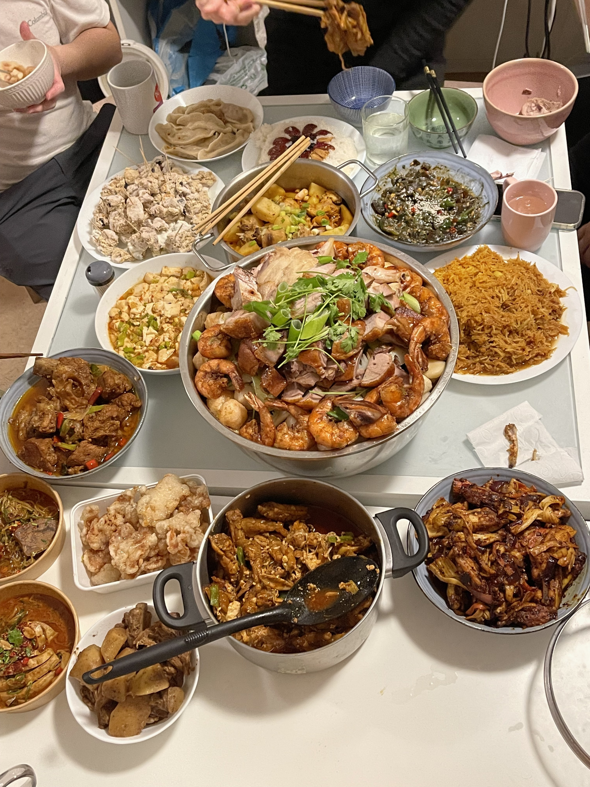
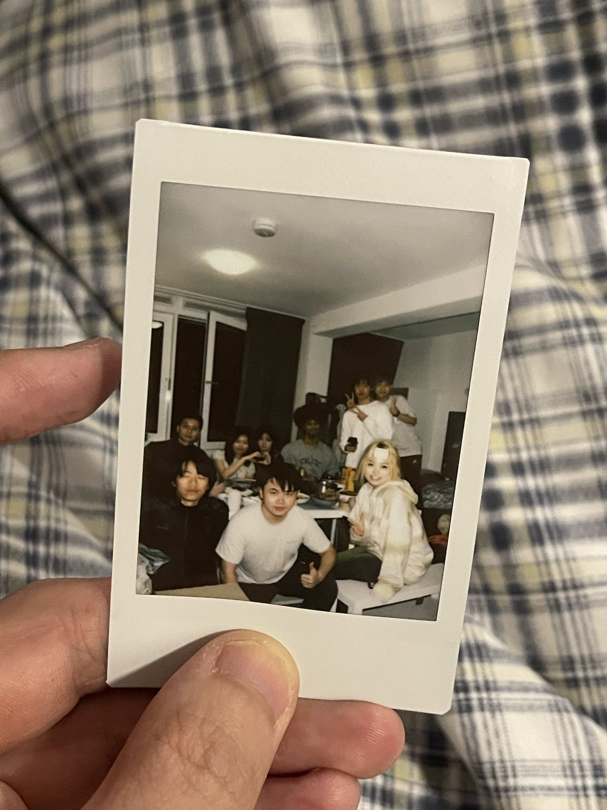

# 2024-02-10
## A dinner
Yesterday was the start of lunar new year. I was invited over to a new year party.
Nianyefan, as 'New Year Eve's dinner.

There were so many dishes on the table, and we could barely eat half of the dishes.
It was nice to see all the faces, new friends and old friends. I was such an introvert
that I felt overwhelmed to make new friends. Surprisingly yesterday I was asked if I
aged more than them. One of them said that she thought that I was kind of `sophisticated`(
I didn't know how to say it in a good way). I was glad. Of course, I made jokes on myself that I
was just being old, but I did not take comment of `vibe of older` offensive. Instead, I took
that as a comment. I didn't think that they could ever understand how hard it is for me be more
sophisticated. Therefore, I appreciated them for not feeling me in other way around. I was always a
late bloomer. I was the shortest in junior high school. I was treated as the younger one as always.
There was a dedication of devotion inside me, however. I felt comfortable to take care of other people.
Maybe, in some way, I was afraid of being disliked.

Bring back topic to our dinner. Although I was not much older than them, I was amazed by how they were
capable of handling their life. I understood that was too superficial to make such kind of judgement,
but I had to admit they did much better job compared to me at their age. You could say they were more
sophisticated than me. They were good at making jokes, they were good at making dishes and they were exellent
at paying attention to others' feelings. I loved being around by them.

I kind of bored by being me sometimes, sentimental. Even judging by the photo, you could see that I was kind of
a outsider, which was a situation I had always stuck in. I was not being pitiful. I knew myself more and more each year.
I was still learning. I observed, absorbed and digested. I was a good friend and good pal, but I did not
know how to love someone. You could argue that it was common illness for all Chinese, of incapable of love and being loved.
Well, I guessed we all had to learn. Some of them in the picture, I did not think that was such a big issue(again, superficial
observation). They were funny and brave enough to express love.

## A comparison
The dinner happened in an apartment differed from my living apartment. I was trying to connect to some students here.
They were also such good people, but in such different way. They were sensitive. For example, I tried to ask one to go out
for dinner in the weekend, she said she was exhausted by the homework. I was not disappointed at all.
Instead, I felt surprised that she had so much in common with me. She shared some thoughts with me, some thoughts that I
was thinking about when I was at her age. We did not bother each other much. We enjoyed the time of being alone and we gained
energy from staying alone.

Another girl was the same age as me. I adored her. She was also, in my judgement, a good friend material.
She reminded me my old time friend, who was also good at social but also compassionate enough to support others.

I worried about both of them. One of them was too reclusive to easily being trapped into emotional landscape.
Another one struggled with study and perfectionism. I felt empathetic for both of them as I have experienced and also
am currently going through similar phases. This sentence occupied my mind every day: 'How I wished our days could be much better'.
I envied those sincerely enjoyed their life.

## Some details
I bought a bottle of 'Baileys' to the party. It was surprisingly good. I also brought some snacks, but we did not have time for
snacks.

I felt overwhelmed today. I guessed I slept too little yesterday after returning from the party, or maybe I just felt home sick.
Another factor might be that I felt disappointed about myself. You could understand, everybody questioned about friendship.
Sometimes I was bothered by the imbalance in a relationship. Everytime I felt overwhelmed, I felt a blank space in my heart.
It was hard to bear with. Sleep well, I said to myself.