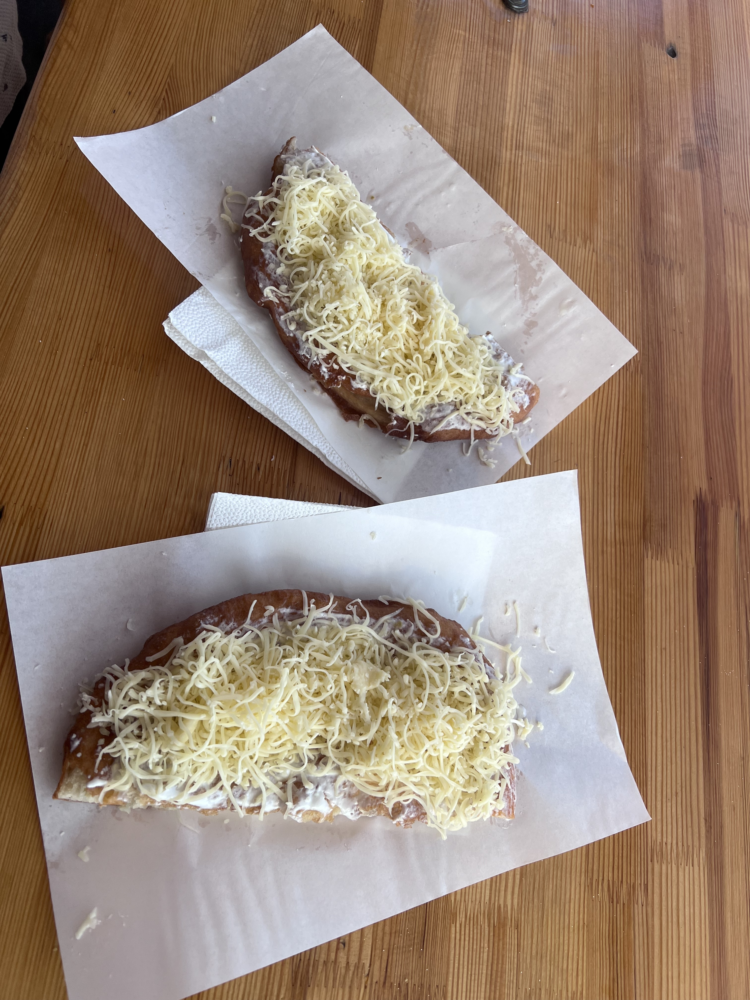

# 2024-07-09 to 2024-07-21 Hungary always sunny

At first, it was quiet rainy. I got off train station Miskolc-Tiszai.
I began to feel unsettled.
The train station is small and old.

What will happen.

This question came to my mind.

EUG, european university game. Over 400 universities participate in this event.
This should be a big event. Why would they hold the event in such a
small city. I had to take the train over 2 hours from Budapest to this city.
Now I had to figure out a way to go to the volunteer center in the University of Miskolc.

I wanted to save money. I tried to download the application. The routes on the application are
so old, that did not match the routes in the Google Maps. I had no choice.
I had to call a Bolt Taxi. Things became even stranger. The city application lacked
maintenance? That was not a good sign. Again. My mind began to picture, how
I would get kidnapped, and my organs would get dug out to sell in some strange labs.

Fortunately nothing happens.

My selfie when I was waiting in the volunteer center.

I went straight to the dormitory after volunteer center. Shocked again.
The room was a 4-people room. Fine, back to school life in Bachelor again.
In the night my three roommates came back one by one.
Naufal, from Indonesia. Ezz Ezz, from Egypt, and David from local Hungary.
That's quite a good combination. I was wondering, based on what, they made such
decision. Well, it turned out great for me.

Some details along the journey.

Naufal is great friend material. He was not only out-going, and talkative, but also
caring and thoughtful. He got me feel welcome in first place so that I did not feel
excluded as the one who arrived late. He seemed to have the ability to make friend
with almost everybody. After I left, I wished I had more time to be friends with him,
but it was what it was. Nothing could be changed. On our day off at Jul 18th, he made a
perfect travel plan in Miskolc. We woke up at 6 am and set off to the local market.
We tried Lángos in the market. It was fresh to me, but the dish was not my taste. It was just
cheese with fried bread. And it just tasted salty and nothing more.

Then we went to a cave. It was funny because both of use were wearing short-sleeved T-shirt,
but the temperature in the cave was below 10 degree. However, it was bearable and we enjoyed this
really short visit. The cave was smaller than I imagined. 

The next event was chair-lifting. You would know after I show you the picture.
I loved loved loved the whole round-trip and the view. Well it was not designed for people whoe
were afraid of height. Both of use enjoyed the height, and the bird-eye view. We took great pictures
from up there.

After a short visit to the lake. we took a classic train back to city center.
The train looked stylish and traditional. There were no windows so that we could
observe the countryside view without obstacles. Besides, the wind breezes through
our hair directly. The train travelled crossed the forest, and villages appeared
through the gaps between trees. The rooftop of the houses were red, which reminded of
houses in Attack On Titan. I should pay visit to the original town someday.
I was slient all the way, because I was obsessed with the view and also, because
I was thinking everything good gonna fade anyway. Like I was destined to leave this journey.
The soft wind made me sleepy. I tried to open my eyes so that I could remember,
every moment. I might never go back again. I had to remember.

Ezz Ezz is mysterious. He told us we could call him Ezz. When he repeated Ezz Ezz,
I decided I should call him Ezz Ezz. I had to say I was obsessed with mystery.
He said he came here last year for another event. 
Our first chance to get familiar with each other came when we wanted to have lunch. He said he was thirsty
and wanted to have water. We went to the city center, but one volunteer said we could be helpful
in the opening ceremony. He did not know how to refuse, and me too.
We ended up standing on the street like two little idiots and waiting for the shuttle
bus to show up. It turned out to be an impressive journey. We should also embrace unknown
journey right? No matter what assumption we gave to the journey. The laser show was amazing,
and we got free dinner when we left thanks to Naufal. Although they both did not enjoy the dinner.

I guessed I loved mystery, and that's why I developed some kind of crush on him.
It was so weird because we did not even talk that much. I also blamed it on summer.
The hot summer. There was a phase he taught me in Egyptian أوبا.
It meant Ooops. A common phase when someone almost tripped. I tried to say in different
way, Oba, Opa, Oppa. It was fun. I also learnt other phrases, as Thank you and Love.
(sounds a lot like hope). We had many little iterations between us.
For example, I would wait by the bus station and sat on the little stair. When the
bus arrived, I would reach out my hands and let him pull me up. I would try to open
my hand and let me clap my hand to cheer us up.

At one night before we decided to play paper airplane the day after. I forgot what
triggered us to do so. He just mentioned it, and I said I would bring you many many paper to
make powerful paper airplane. The next day, I brought back a stack of paper. He made us two
paper planes. I got the first one, and he took the second one. We tried them in a competition.
We flew the paper planes out of the window, and whoever threw the plane closer needed to take the 
paper planes back. I got the bad one. The paper plane would fly for a second and take a right turn.
I lost of course. I stepped out of the house, standing in front of the window. I tried to
fly the paper planes back into the windows. My bad one did not listen to me. It took another turn
and landed on the right side of the windows, which meant we had to crawl over the window, and
got it back. It was simple but fun. I felt like I suddenly was back in childhood. We matched on
our pure, childish heart.

Well I always knew it was one-sided. I am trying to get over with the feelings. It is difficult.
I have never done drugs, but I think it should be similar. Withdrawal symptoms. That's the word.
I want to talk, and want to just be friends. It is one-sided. I make the conversation, and I will
always be the one who take the first move. I need to pull back. I need to calm down.

To be honest, I don't know what I should say about David. We barely make any conversations.
Maybe there is nothing common exists between us. We are just like two parallel lines.
He was quite rigid. I assumed he would join the army one day in his life.
He was quite busy all day. Every day he woke up before 6 am, and came back after 9pm.
He was responsible with his job. He took care of two of the men volleyball team.
He tried to do his best every day. I remembered one day, I said to him that I
thought he was superman because he only slept 6 hours a day.
He said it was quite sufficient, and he always slept 5 to 6 hours.
I was stoned. I was the kind of people felt tired after 8-hour sleep.

My journey here was quite satisfying to my surprise.
At first, I was like a little shocked rabbit, complaining to my friends about how I
was worried, and I kept making bad decisions in my life. 
When everything ended, I discovered new meanings to my life.
I explored new things, and that's what matters.
Like a driftwood, I may be drifting for a long long time, but I
will make new adventures, forever and always.

