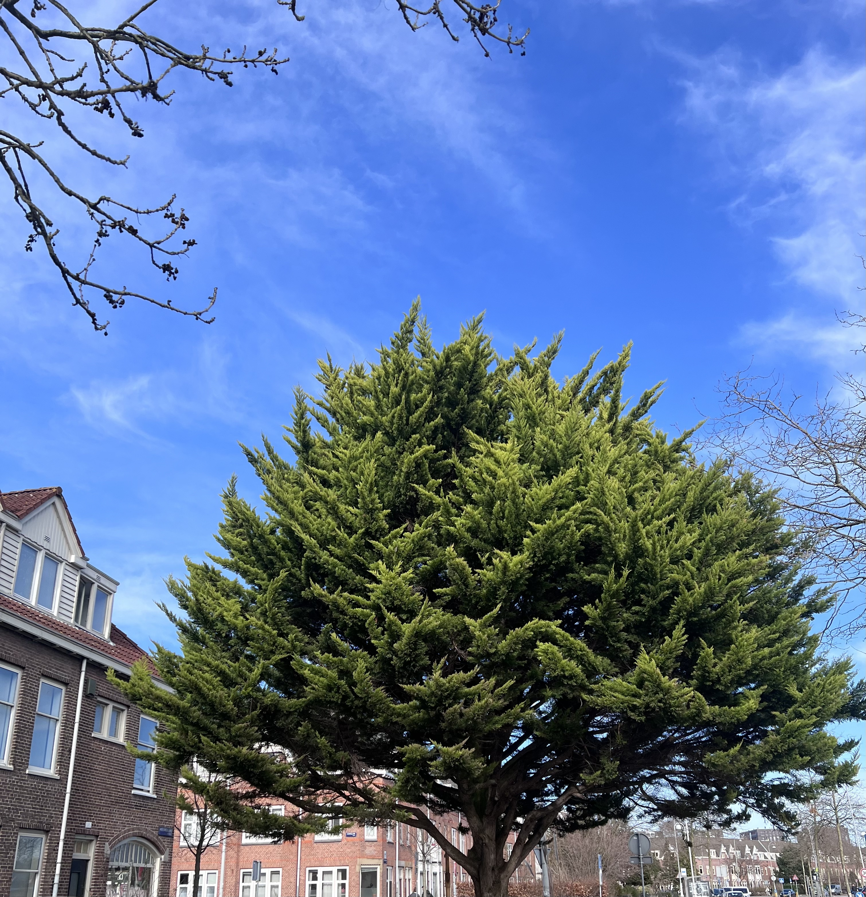
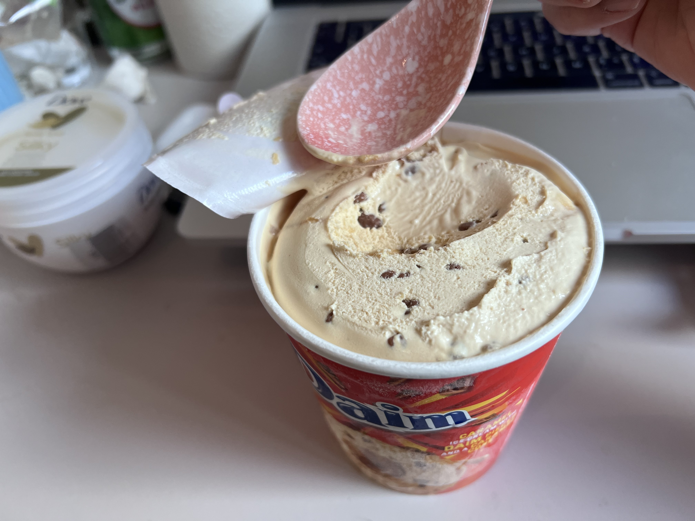

# 2024-03-03 Superb sunny and sometimes cloudy

## Grandma in my dream
Exactly this monday morning, I dreamt about grandma. She was tiny but still healthy looking.
She looked she gained some weight. She was sitting in the chair in our old home. I reached
out to her and she douched. She went away, sat in the ground in the corner of our old giant
black chair. I followed, and held her hand again: "What's wrong". Her arm was warm.
She said: "Please let Xiaomin remember to pass the word to Qizi". I woke up.
I did not dream about her for a long time. She was a complicated image in my mind.
In fact, all elder people in my hometown, I wanted to know what's going on in their
mind. People there never showed their feelings. It felt like everything did not matter
except just living. You survived, and then you died. There was superstition in China
that people in China would come into your dream and make a request after they passed away.
I wondered if it was a way grandma tell me something she had not done. This thought circled
around my head.

## A good weather hangout

The weather was so good, and I asked for a friend to go for a walk. We basically toured our
neighbors in circle. Back in Guangzhou, I never treasured the good weather so much.
Here, in winter, the wind was annoying, and the rain. Although I still kind of `overestimated`
the weather, because I thought it would be much worse.

I came across this best winter tree. The trees here were almost all bold. We came into surprise
when we could find a tree with so many gorgeous leaves. We do some groceries and
chose another path back. We both did not want to do repetitive stuff.

She asked me one question, "Do you have any plans for the future". To be honest,
I could not answer this question. Ever since pandemic, I lost the imagination about
the future. I could even think about the things in the next two months. Weeks ago,
a person asked me about my plans in Kingsdag, and invited me to go on a trip with them
in Italy. I honestly did not know. The Kingsdag would be about two months later.
I did not know what will happen then. I said I needed further consideration.
However, to answer Cici's question, I had something in mind. I wanted to travel.
I wanted to go on a safari in Africa to witness animal immigration. I dreamt about
Yellow Stone Park I used to watch in documentary. I fancied Iguazu Falls where Leslie Cheung
used to stand. Cape of Good Hope, I wanted to stand in this place where I thought was the end of the world.

She said she wanted to experience more. No matter it was good experience or bad exprience.
I agreed. We all needed to experience. I thought about grandma now as I am writing these down.
Are they lonely? Did they ever dream about a warm hug? They carried tons of history, to survive
from dark days in China. They were buried with their secrets. Did they want to see what
was like outside their little town? I think the answer is no. They would not bother
thinking about that. I could not. I can not revert what I have seen. I could not withdraw from
my ambition. LOL, maybe that's what the internet ruined us. I have to experience more.
I don't want to stay in a grave and regret about things I have not done afterlife.

Ice cream here are too sweet, not gonna lie.